# 🛍️ PHP CRUD MySQL - ระบบจัดการร้านค้าออนไลน์

ระบบจัดการฐานข้อมูลร้านค้าออนไลน์ สร้างด้วย PHP และ MySQL รองรับการทำ CRUD (Create, Read, Update, Delete) บน 5 ตารางหลัก พร้อมฟังก์ชันค้นหาและการตรวจสอบข้อมูล (Validation)

## 📑 สารบัญ

- [คุณสมบัติหลัก](#-คุณสมบัติหลัก)
- [โครงสร้างฐานข้อมูล](#-โครงสร้างฐานข้อมูล)
- [การติดตั้ง](#-การติดตั้ง)
- [การนำเข้าฐานข้อมูล](#-การนำเข้าฐานข้อมูล)
- [การจำลองเซิร์ฟเวอร์](#-การจำลองเซิร์ฟเวอร์)
- [การใช้งาน](#-การใช้งาน)
- [รูปตัวอย่างการใช้งาน](#-รูปตัวอย่างการใช้งาน)
- [การนำไปต่อยอด](#-การนำไปต่อยอด)

---

## ✨ คุณสมบัติหลัก

- ✅ **CRUD Operations** - เพิ่ม, แสดง, แก้ไข, ลบ ข้อมูล
- ✅ **Search Function** - ค้นหาข้อมูลด้วยคำสำคัญ
- ✅ **Form Validation** - ตรวจสอบข้อมูลก่อนบันทึก
- ✅ **Prepared Statements** - ป้องกัน SQL Injection
- ✅ **XSS Protection** - ป้องกัน Cross-Site Scripting
- ✅ **Responsive Design** - รองรับการแสดงผลหลายขนาดจอ
- ✅ **Foreign Key Relationships** - เชื่อมโยงข้อมูลระหว่างตาราง

---

## 📊 โครงสร้างฐานข้อมูล

### ER Diagram

```
┌──────────────────┐     ┌──────────────────┐     ┌──────────────────┐
│    Products      │     │     Orders       │     │   OrderLine      │
├──────────────────┤     ├──────────────────┤     ├──────────────────┤
│ ProductID (PK)   │◄───┐│ OrderID (PK)     │◄───┐│ OrderID (PK/FK) │
│ ProductName      │     │ CustomerID (FK)  │     │ ProductID (PK/FK)│
│ Picture          │     │ ShippingCompanyID│     │ Quantity         │
│ Category         │     │ OrderDateTime    │     └──────────────────┘
│ Description      │     └──────────────────┘
│ Price            │               ▲
│ QuantityStock    │               │
└──────────────────┘               │
                                  │
┌──────────────────┐               │
│   Customers      │               │
├──────────────────┤               │
│ CustomerID (PK)  │───────────────┘
│ CustomerName     │
│ AddressLine1     │
│ City             │
│ Country          │
│ PostalCode       │
│ MobilePhone      │
└──────────────────┘

┌──────────────────┐
│ ShippingCompany  │
├──────────────────┤
│ ShippingCompID   │
│ CompanyName      │
│ Address          │
│ City             │
│ Country          │
└──────────────────┘
```

### ตารางข้อมูล

| ตาราง | คำอธิบาย | จำนวนฟิลด์ |
|--------|----------|-------------|
| **Products** | ข้อมูลสินค้า | 7 ฟิลด์ |
| **Customers** | ข้อมูลลูกค้า | 7 ฟิลด์ |
| **ShippingCompany** | ข้อมูลบริษัทขนส่ง | 5 ฟิลด์ |
| **Orders** | ข้อมูลคำสั่งซื้อ | 4 ฟิลด์ |
| **OrderLine** | รายการสินค้าในคำสั่งซื้อ | 3 ฟิลด์ |

---

## 🚀 การติดตั้ง

### ข้อกำหนดระบบ (Requirements)

- **PHP** เวอร์ชัน 7.0 ขึ้นไป
- **MySQL** เวอร์ชัน 5.6 ขึ้นไป
- **Web Server** (Apache, Nginx, หรือ XAMPP)
- **Browser** (Chrome, Firefox, Edge, Safari)

### ขั้นตอนการติดตั้ง

#### 1. ติดตั้ง XAMPP (แนะนำ)

**สำหรับ Windows:**

1. ดาวน์โหลด XAMPP จาก https://www.apachefriends.org/
2. ติดตั้งตามค่าเริ่มต้น (Next → Next → Install)
3. เปิด XAMPP Control Panel

**สำหรับ macOS:**

1. ดาวน์โหลด XAMPP สำหรับ macOS
2. ติดตั้งและเปิด XAMPP Manager

**สำหรับ Linux:**

```bash
# Ubuntu/Debian
sudo apt update
sudo apt install xampp
```

#### 2. ดาวน์โหลดโปรเจกต์

```bash
# ดาวน์โหลดโปรเจกต์หรือ clone จาก GitHub
git clone [repository-url]
# หรือแตกไฟล์ zip ที่ได้รับ
```

#### 3. นำไฟล์ไปวางใน htdocs ของ XAMPP

**📌 ทำไมต้องใส่ใน htdocs?**

`htdocs` เป็นโฟลเดอร์หลักของ XAMPP ที่ใช้เก็บไฟล์เว็บทุกประเภท (HTML, PHP, ฯลฯ) เมื่อเราเข้าผ่าน `http://localhost/` XAMPP จะค้นหาไฟล์จากโฟลเดอร์นี้

---

**💡 วิธีที่ 1: คัดลองโฟลเดอร์ (วิธีง่ายที่สุด)**

**Windows:**
1. ไปที่ตำแหน่งที่ดาวน์โหลดโปรเจกต์
2. คัดลอกโฟลเดอร์ `PHP-CRUD-MySQL-LEVEL4` ทั้งหมด
3. ไปที่ `C:\xampp\htdocs\`
4. วางโฟลเดอร์ลงไป
5. ตรวจสอบว่าโครงสร้างเป็น `C:\xampp\htdocs\PHP-CRUD-MySQL-LEVEL4\`

**macOS:**
1. ไปที่ตำแหน่งที่ดาวน์โหลดโปรเจกต์
2. คัดลอกโฟลเดอร์ `PHP-CRUD-MySQL-LEVEL4` ทั้งหมด
3. ไปที่ `/Applications/XAMPP/htdocs/`
4. วางโฟลเดอร์ลงไป
5. ตรวจสอบว่าโครงสร้างเป็น `/Applications/XAMPP/htdocs/PHP-CRUD-MySQL-LEVEL4/`

**Linux:**
1. ไปที่ตำแหน่งที่ดาวน์โหลดโปรเจกต์
2. คัดลอกโฟลเดอร์ `PHP-CRUD-MySQL-LEVEL4` ทั้งหมด
3. ไปที่ `/opt/lampp/htdocs/`
4. วางโฟลเดอร์ลงไป
5. ตรวจสอบว่าโครงสร้างเป็น `/opt/lampp/htdocs/PHP-CRUD-MySQL-LEVEL4/`

---

**💡 วิธีที่ 2: ใช้ Command Line (สำหรับผู้ที่คุ้นเคย)**

**Windows (Command Prompt):**
```cmd
xcopy /E /I "C:\Users\[Username]\Downloads\PHP-CRUD-MySQL-LEVEL4" "C:\xampp\htdocs\PHP-CRUD-MySQL-LEVEL4"
```

**macOS/Linux (Terminal):**
```bash
# สมมติโปรเจกต์อยู่ที่ Downloads
cp -r ~/Downloads/PHP-CRUD-MySQL-LEVEL4 /Applications/XAMPP/htdocs/
# หรือ
cp -r ~/Downloads/PHP-CRUD-MySQL-LEVEL4 /opt/lampp/htdocs/
```

---

**✅ ตรวจสอบหลังวางไฟล์:**

1. เปิดโฟลเดอร์ htdocs ขึ้นมา:
   - **Windows:** ไปที่ `C:\xampp\htdocs\`
   - **macOS:** ไปที่ `/Applications/XAMPP/htdocs/`
   - **Linux:** ไปที่ `/opt/lampp/htdocs/`

2. ตรวจสอบว่ามีโฟลเดอร์ `PHP-CRUD-MySQL-LEVEL4` อยู่หรือไม่

3. เข้าไปในโฟลเดอร์ ตรวจสอบว่ามีไฟล์ต่อไปนี้:
   - ✅ `db.php`
   - ✅ `index.php`
   - ✅ `shop.sql`
   - ✅ `style.css`
   - ✅ `products.php`, `customers.php` ฯลฯ

4. **หากเจอทั้งหมด = วางไฟล์สำเร็จ!** 👍

#### 4. ตรวจสอบการตั้งค่าฐานข้อมูล

เปิดไฟล์ `db.php` และตรวจสอบข้อมูลการเชื่อมต่อ:

```php
$conn = new mysqli("localhost", "root", "", "shop");
```

- **localhost** - ที่อยู่เซิร์ฟเวอร์ (ปกติใช้ localhost)
- **root** - ชื่อผู้ใช้ฐานข้อมูล (XAMPP ค่าเริ่มต้นคือ root)
- **""** - รหัสผ่าน (XAMPP ค่าเริ่มต้นคือ ว่าง)
- **shop** - ชื่อฐานข้อมูล (สร้างในขั้นตอนถัดไป)

---

## 📥 การนำเข้าฐานข้อมูล

### วิธีที่ 1: ใช้ phpMyAdmin (แนะนำ)

1. **เปิด Apache และ MySQL**
   - เปิด XAMPP Control Panel
   - กดปุ่ม **Start** ที่ Apache และ MySQL
   - รอให้สถานะเป็นสีเขียว

2. **เข้า phpMyAdmin**
   - เปิด browser ไปที่: `http://localhost/phpmyadmin`
   - หรือคลิกที่ปุ่ม **Admin** ข้าง MySQL

3. **สร้างฐานข้อมูล**
   - คลิกที่ **New** (หรือ "สร้างฐานข้อมูล")
   - ตั้งชื่อฐานข้อมูล: `shop`
   - เลือก Collation: `utf8mb4_unicode_ci`
   - กด **Create**

4. **นำเข้าไฟล์ SQL**
   - เลือกฐานข้อมูล `shop`
   - คลิกที่แท็บ **Import**
   - คลิก **Choose File** เลือกไฟล์ `shop.sql` ในโปรเจกต์
   - กด **Go** ที่ด้านล่าง

5. **ตรวจสอบข้อมูล**
   - ดูที่แท็บ **Structure** - ควรมี 5 ตาราง
   - ดูที่แท็บ **Browse** - ควรมีข้อมูลตัวอย่าง

### วิธีที่ 2: ใช้ Command Line

**Windows (CMD):**

```cmd
cd C:\xampp\mysql\bin
mysql -u root -p shop < C:\xampp\htdocs\PHP-CRUD-MySQL-LEVEL4\shop.sql
```

**macOS/Linux:**

```bash
/opt/lampp/bin/mysql -u root -p shop < /opt/lampp/htdocs/PHP-CRUD-MySQL-LEVEL4/shop.sql
```

---

## 🖥️ การจำลองเซิร์ฟเวอร์

### เริ่มเซิร์ฟเวอร์ด้วย XAMPP

1. **เปิด XAMPP Control Panel**
2. **กด Start ที่ Apache**
   - Apache = Web Server (รัน PHP)
   - สถานะควรเป็นสีเขียว
3. **กด Start ที่ MySQL**
   - MySQL = Database Server
   - สถานะควรเป็นสีเขียว

### เข้าถึงระบบ

เปิด browser และเข้าที่:

```
http://localhost/PHP-CRUD-MySQL-LEVEL4/
```

หรือ

```
http://localhost/PHP-CRUD-MySQL-LEVEL4/index.php
```

ระบบจะ redirect ไปที่หน้าสินค้าโดยอัตโนมัติ

### การหยุดเซิร์ฟเวอร์

เมื่อใช้งานเสร็จ:

1. เปิด XAMPP Control Panel
2. กด **Stop** ที่ Apache และ MySQL

---

## 📖 การใช้งาน

### การนำทางในระบบ

ระบบมีเมนูนำทางที่ด้านบนของทุกหน้า:

| เมนู | หน้า | คำอธิบาย |
|-------|------|----------|
| **Products** | `products.php` | จัดการข้อมูลสินค้า |
| **Customers** | `customers.php` | จัดการข้อมูลลูกค้า |
| **Shipping** | `shipping.php` | จัดการข้อมูลบริษัทขนส่ง |
| **Orders** | `orders.php` | จัดการคำสั่งซื้อ |
| **Order Lines** | `orderlines.php` | จัดการรายการสินค้าในคำสั่งซื้อ |

### การทำ CRUD Operations

ทุกตารางมีโครงสร้างไฟล์เหมือนกัน:

```
[table].php       - แสดงรายการ + ค้นหา (READ)
[table]_form.php  - ฟอร์ม เพิ่ม/แก้ไข
[table]_save.php  - บันทึก (CREATE/UPDATE)
[table]_delete.php - ลบ (DELETE)
```

#### 1️⃣ แสดงรายการ (Read)

- เข้าไปที่หน้าของแต่ละตาราง (เช่น `products.php`)
- ดูรายการข้อมูลทั้งหมดในตาราง
- สามารถค้นหาข้อมูลด้วยกล่องค้นหา

#### 2️⃣ เพิ่มข้อมูล (Create)

- คลิกปุ่ม **"Add New [Table Name]"** สีเขียว
- กรอกข้อมูลในฟอร์ม
- กดปุ่ม **"Save"**
- ระบบจะตรวจสอบข้อมูล (Validation)
  - ถ้าถูกต้อง → บันทึกและกลับหน้ารายการ
  - ถ้าผิด → แสดงข้อผิดพลาดและให้กรอกใหม่

#### 3️⃣ แก้ไขข้อมูล (Update)

- คลิกที่ปุ่ม **"Edit"** สีน้ำเงิน ของรายการที่ต้องการแก้
- แก้ไขข้อมูลในฟอร์ม
- กดปุ่ม **"Save"**
- ข้อมูลจะถูกอัปเดต

#### 4️⃣ ลบข้อมูล (Delete)

- คลิกที่ปุ่ม **"Delete"** สีแดง ของรายการที่ต้องการลบ
- ยืนยันการลบ (ถ้ามี)
- ข้อมูลจะถูกลบออกจากฐานข้อมูล

⚠️ **หมายเหตุ:** บางตาราง (เช่น Orders) ไม่สามารถลบได้ถ้ามีข้อมูลที่เกี่ยวข้องในตารางอื่น (Foreign Key Constraint)

### การค้นหาข้อมูล

1. พิมพ์คำสำคัญในกล่องค้นหา
2. กดปุ่ม **"Search"**
3. ระบบจะแสดงรายการที่ตรงกับคำค้นหา
4. คลิกชื่อคอลัมน์เพื่อเรียงลำดับ (ถ้ามี)

---

## 📸 รูปตัวอย่างการใช้งาน

### หน้ารายการสินค้า

ระบบแสดงรายการสินค้าทั้งหมด พร้อมภาพประกอบ ราคา และจำนวนในสต็อก

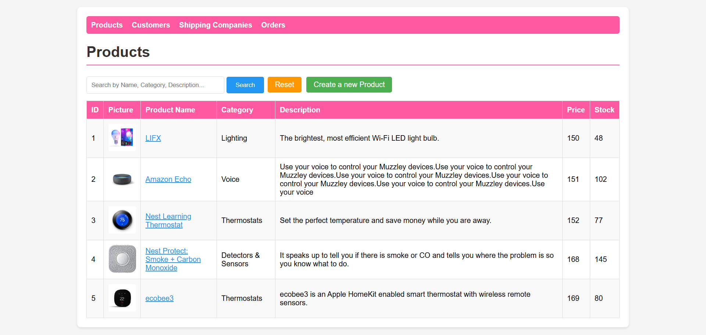

**ฟีเจอร์:**
- 🔍 กล่องค้นหาด้วยชื่อสินค้า
- ➕ ปุ่มเพิ่มสินค้าใหม่
- ✏️ ปุ่มแก้ไขสินค้า
- 🗑️ ปุ่มลบสินค้า

### การค้นหาข้อมูล

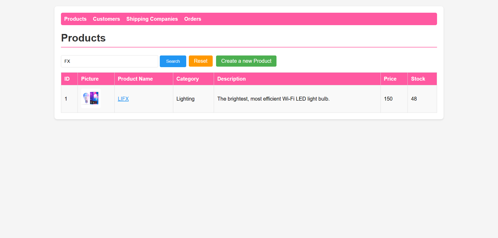

### ฟอร์มเพิ่มสินค้า

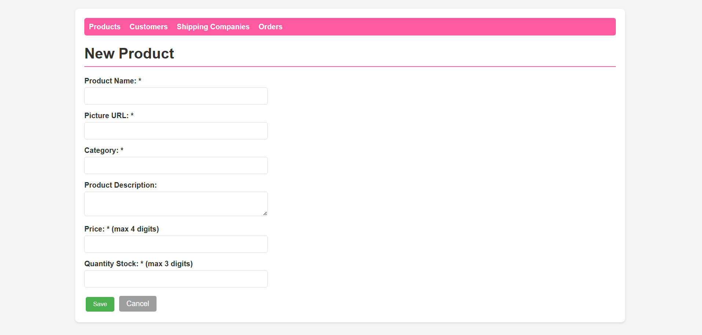

**การตรวจสอบข้อมูล:**
- ✅ ชื่อสินค้า (ต้องกรอก, ไม่เกิน 50 ตัวอักษร)
- ✅ รูปภาพ (ต้องกรอก URL)
- ✅ หมวดหมู่ (ต้องกรอก)
- ✅ ราคา (ต้องเป็นตัวเลข, 0-9999)
- ✅ จำนวนในสต็อก (ต้องเป็นตัวเลข)

### ฟอร์มแก้ไขสินค้า

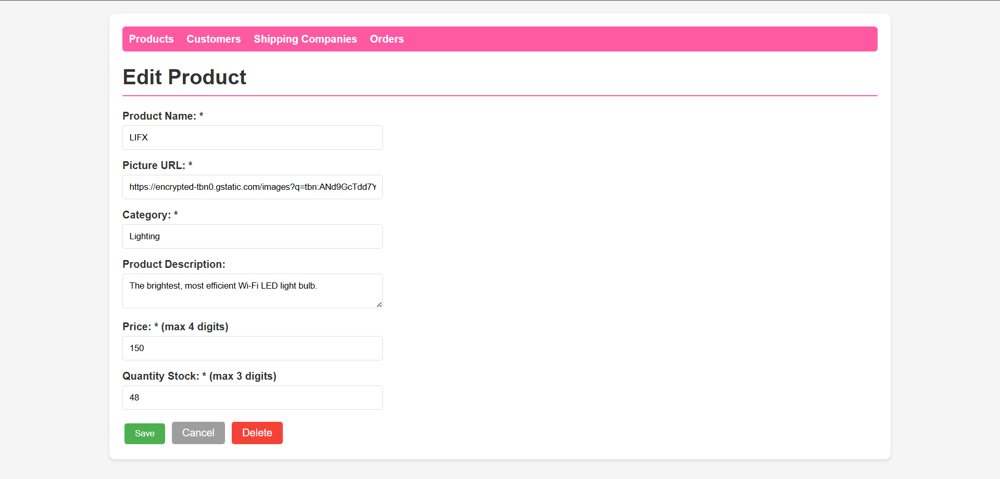

### หน้ารายการลูกค้า


### ฟอร์มเพิ่มลูกค้า

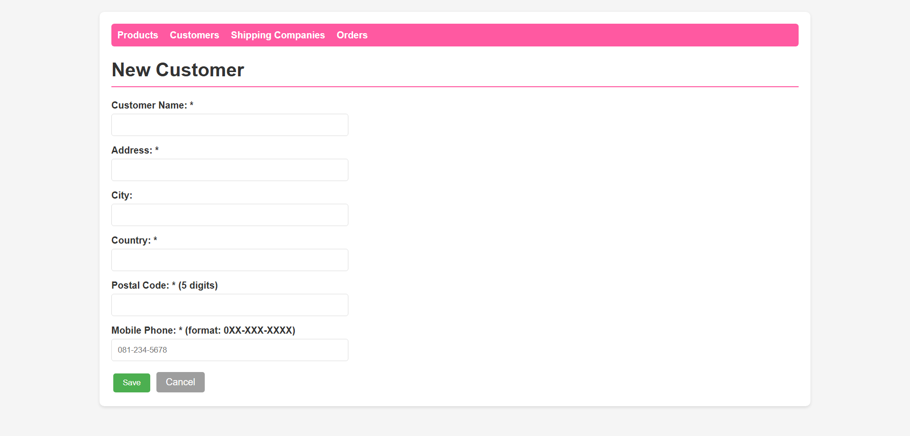

**การตรวจสอบข้อมูล:**
- ✅ ชื่อลูกค้า (ต้องกรอก)
- ✅ ที่อยู่ (ต้องกรอก)
- ✅ ประเทศ (ต้องกรอก)
- ✅ รหัสไปรษณีย์ (ต้องกรอก, 5 ตัว)
- ✅ เบอร์โทร (รูปแบบ: 0XX-XXX-XXXX)

### ฟอร์มแก้ไขลูกค้า

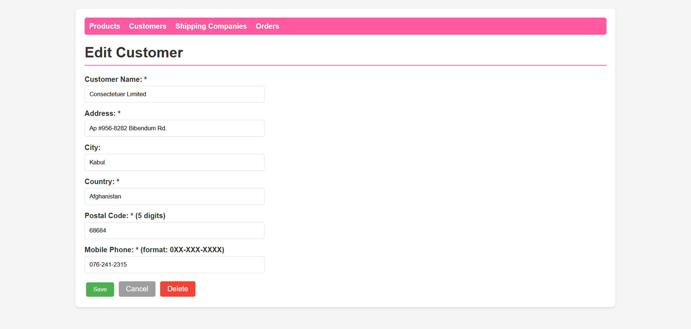

### หน้ารายการคำสั่งซื้อ (Orders)

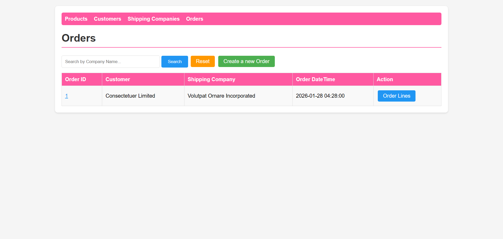

**ฟีเจอร์พิเศษ:**
- 🔗 แสดงชื่อลูกค้าแทน ID (JOIN)
- 🚚 แสดงชื่อบริษัทขนส่ง
- 📅 แสดงวันเวลาที่สั่งซื้อ

### ฟอร์มเพิ่มคำสั่งซื้อ

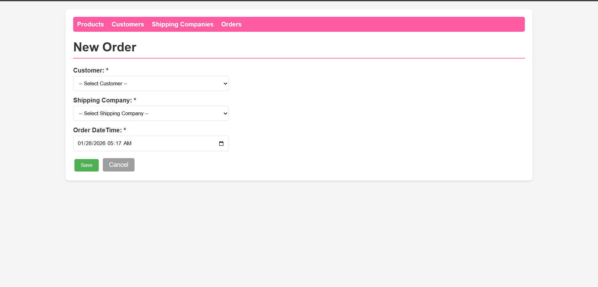

**ฟีเจอร์:**
- 📋 Dropdown เลือกลูกค้า
- 🚚 Dropdown เลือกบริษัทขนส่ง
- 📅 วันเวลากรอกอัตโนมัติ

### หน้ารายการบริษัทขนส่ง

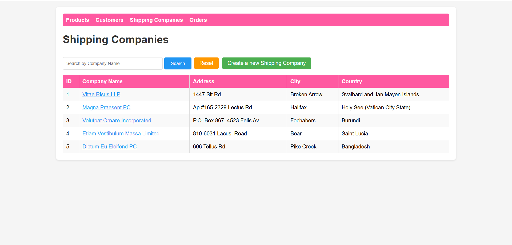

### ฟอร์มเพิ่มบริษัทขนส่ง

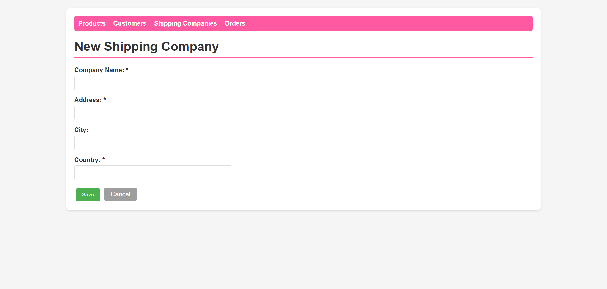

### ฟอร์มแก้ไขบริษัทขนส่ง

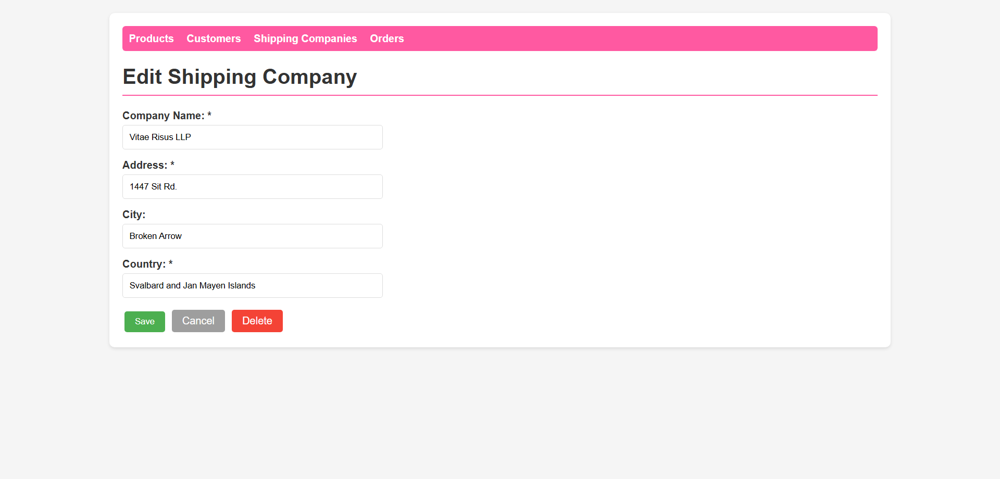

---

## 🔧 การนำไปต่อยอด

### 1. การเพิ่มฟีเจอร์ใหม่

#### เพิ่มการแบ่งหน้า (Pagination)

```php
// list.php
$page = $_GET['page'] ?? 1;
$perPage = 10;
$offset = ($page - 1) * $perPage;

$sql = "SELECT * FROM Products LIMIT $offset, $perPage";
```

#### เพิ่มการจัดเรียง (Sorting)

```php
// list.php
$orderBy = $_GET['order'] ?? 'ProductID';
$dir = $_GET['dir'] ?? 'ASC';

$sql = "SELECT * FROM Products ORDER BY $orderBy $dir";
```

#### เพิ่มการอัปโหลดรูปภาพ

```php
// save.php
if (isset($_FILES['image']) && $_FILES['image']['error'] == 0) {
    $targetDir = "uploads/";
    $fileName = time() . '_' . $_FILES['image']['name'];
    move_uploaded_file($_FILES['image']['tmp_name'], $targetDir . $fileName);
    $picture = $targetDir . $fileName;
}
```

### 2. การปรับแต่ง UI

เปิดไฟล์ `style.css` และปรับแต่ง:

```css
/* เปลี่ยนสีธีม */
h1 { border-bottom: 2px solid #ff59a1; }  /* เปลี่ยนสีเส้น */
nav { background: #ff59a1; }              /* เปลี่ยนสีเมนู */
.btn-add { background: #4CAF50; }         /* เปลี่ยนสีปุ่ม */
```

### 3. การเพิ่มตารางใหม่

สร้างตารางใหม่ตามรูปแบบ:

1. **สร้างไฟล์ SQL** - เพิ่มคำสั่ง CREATE TABLE ใน `shop.sql`
2. **สร้างไฟล์ PHP** - คัดลอกโครงสร้างไฟล์:
   - `[table].php`
   - `[table]_form.php`
   - `[table]_save.php`
   - `[table]_delete.php`
3. **แก้ไขการเชื่อมต่อ** - ปรับชื่อตารางและฟิลด์ในแต่ละไฟล์
4. **เพิ่มเมนู** - เพิ่มลิงก์ในส่วน `<nav>` ของแต่ละไฟล์

### 4. การเพิ่มการรับรอง (Authentication)

สร้างระบบ Login:

```php
// login.php
session_start();
include 'db.php';

$username = $_POST['username'];
$password = $_POST['password'];

$stmt = $conn->prepare("SELECT * FROM Users WHERE username=? AND password=?");
$stmt->bind_param("ss", $username, md5($password));
$stmt->execute();

if ($stmt->get_result()->num_rows > 0) {
    $_SESSION['logged_in'] = true;
    header("Location: index.php");
}
```

### 5. การเชื่อมต่อ API

เพิ่มการแสดงผล JSON:

```php
// api.php
header('Content-Type: application/json');
include 'db.php';

$result = $conn->query("SELECT * FROM Products");
$data = [];

while ($row = $result->fetch_assoc()) {
    $data[] = $row;
}

echo json_encode($data);
```

### 6. การเพิ่ม Report

```php
// report.php
include 'db.php';

$sql = "SELECT c.CustomerName, COUNT(o.OrderID) as TotalOrders, 
        SUM(ol.Quantity * p.Price) as TotalSpent
        FROM Customers c
        LEFT JOIN Orders o ON c.CustomerID = o.CustomerID
        LEFT JOIN OrderLine ol ON o.OrderID = ol.OrderID
        LEFT JOIN Products p ON ol.ProductID = p.ProductID
        GROUP BY c.CustomerID
        ORDER BY TotalSpent DESC";
```

---

## 🛠️ การแก้ไขปัญหา (Troubleshooting)

### ปัญหา: DB Error

**สาเหตุ:** ไม่สามารถเชื่อมต่อฐานข้อมูลได้

**วิธีแก้:**
1. ตรวจสอบว่า MySQL ทำงานอยู่ใน XAMPP Control Panel
2. ตรวจสอบข้อมูลใน `db.php`
3. แก้ไขรหัสผ่าน MySQL ใน `db.php` (ถ้าตั้งรหัสไว้)

### ปัญหา: แสดงหน้าว่าง

**สาเหตุ:** PHP ไม่ทำงาน

**วิธีแก้:**
1. ตรวจสอบว่า Apache ทำงานอยู่
2. เปิดใช้งาน error โดยเพิ่มใน `php.ini`:
   ```ini
   display_errors = On
   error_reporting = E_ALL
   ```
3. รีสตาร์ท Apache

### ปัญหา: รูปภาพไม่แสดง

**สาเหตุ:** URL รูปภาพไม่ถูกต้อง

**วิธีแก้:**
1. ตรวจสอบ URL ในฐานข้อมูล
2. ใช้ URL ที่เข้าถึงได้จริง (https://...)
3. หรือเปลี่ยนเป็นระบบอัปโหลดรูป

---

## 📁 โครงสร้างโปรเจกต์

```
PHP-CRUD-MySQL-LEVEL4/
├── README.md                    # ไฟล์นี้
├── CHEAT_SHEET.md              # สูตร PHP CRUD สำหรับสอบ
├── db.php                      # ไฟล์เชื่อมต่อฐานข้อมูล
├── style.css                   # ไฟล์ CSS
├── shop.sql                    # ไฟล์ SQL สร้างฐานข้อมูล
│
├── products.php                # รายการสินค้า
├── product_form.php            # ฟอร์มสินค้า
├── product_save.php            # บันทึกสินค้า
├── product_delete.php          # ลบสินค้า
│
├── customers.php               # รายการลูกค้า
├── customer_form.php           # ฟอร์มลูกค้า
├── customer_save.php           # บันทึกลูกค้า
├── customer_delete.php         # ลบลูกค้า
│
├── shipping.php                # รายการบริษัทขนส่ง
├── shipping_form.php           # ฟอร์มบริษัทขนส่ง
├── shipping_save.php           # บันทึกบริษัทขนส่ง
├── shipping_delete.php         # ลบบริษัทขนส่ง
│
├── orders.php                  # รายการคำสั่งซื้อ
├── order_form.php              # ฟอร์มคำสั่งซื้อ
├── order_save.php              # บันทึกคำสั่งซื้อ
├── order_delete.php            # ลบคำสั่งซื้อ
│
├── orderlines.php              # รายการ Order Line
├── orderline_form.php          # ฟอร์ม Order Line
├── orderline_save.php          # บันทึก Order Line
├── orderline_delete.php        # ลบ Order Line
│
├── simple-imgs/                # โฟลเดอร์รูปภาพตัวอย่าง
└── exam/                       # โฟลเดอร์ตัวอย่างสำหรับสอบ
```

---

## 📚 แหล่งเรียนรู้เพิ่มเติม

- **PHP Documentation:** https://www.php.net/docs.php
- **MySQL Documentation:** https://dev.mysql.com/doc/
- **W3Schools PHP:** https://www.w3schools.com/php/
- **MDN Web Docs:** https://developer.mozilla.org/

---

## 👨‍💻 นักพัฒนา

โปรเจกต์นี้พัฒนาขึ้นเพื่อการศึกษาและการใช้งานจริง สามารถนำไปต่อยอดและปรับแต่งได้ตามความต้องการ

---

## 📄 ใบอนุญาต (License)

โปรเจกต์นี้เปิดให้ใช้งานฟรีสำหรับการศึกษาและการพัฒนา

---

**หมายเหตุ:** หากพบปัญหาหรือมีข้อสงสัย ให้ตรวจสอบไฟล์ `CHEAT_SHEET.md` สำหรับสูตรและเทคนิคการเขียนโค้ด PHP CRUD